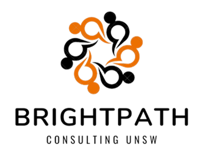

# Actuarial Theory and Practice A @ UNSW

# BrightPath Consulting - SuperLife Saving Lives Health Incentive Program

_“Our bodies are our gardens – our wills are our gardeners.” – William Shakespeare_

  
  

## Overview

In the modern age of Lumaria, health is increasingly recognised as the ultimate wealth. BrightPath Consulting, in collaboration with SuperLife Insurance, introduces a cutting-edge health incentive program designed to encourage healthy behaviours among policyholders, thereby reducing mortality rates, boosting life insurance sales, and enhancing market competitiveness.

This GitHub repository houses all project materials for the SuperLife Insurance Incentive Program, including data analyses, R coding scripts, modelling methodologies, and comprehensive documentation on pricing strategies and sensitivity testing analysis. We aim to provide a transparent, detailed overview of our approach to creating a sustainable, beneficial program for SuperLife and its customers.

